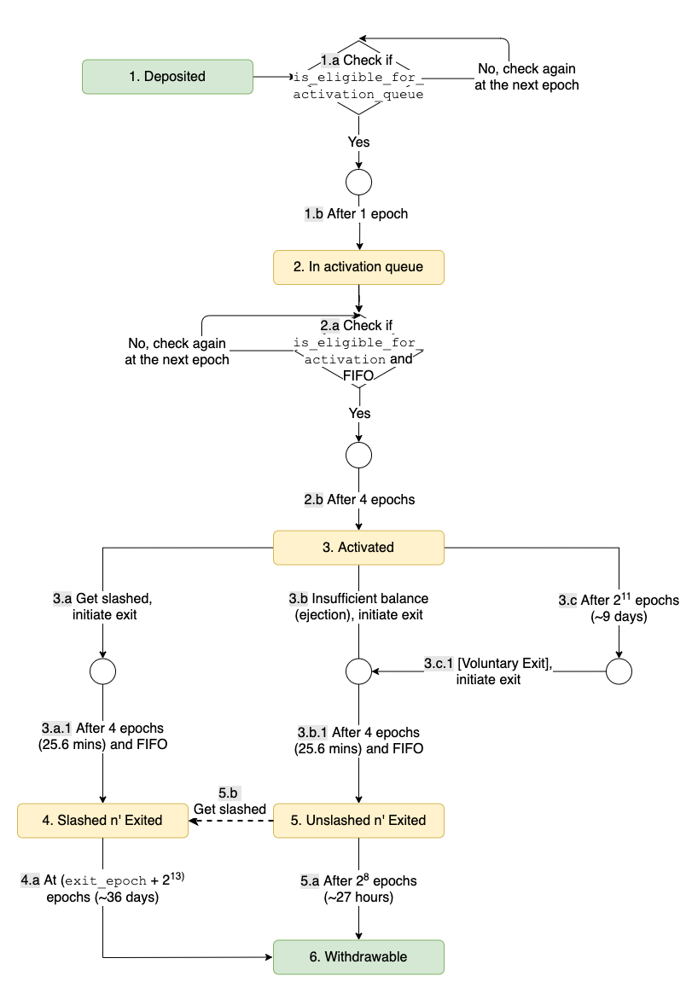
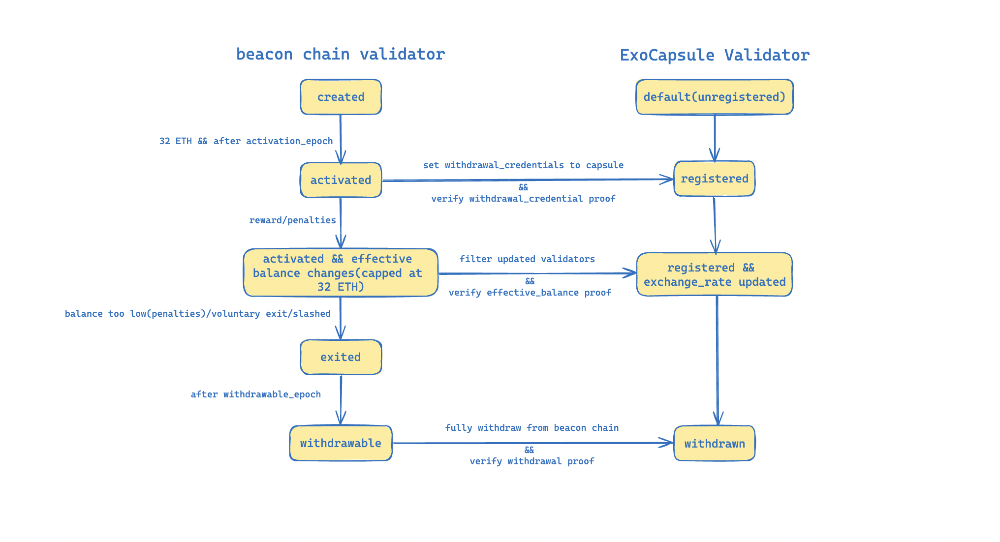

# Ethereum Native Restaking for Exocore

## Overview

Native restaking is distinguished from LST restaking with unique features: No LST token that is derived from staked ETH is involved for native stakers to participate in the Exocore restaking.

Especially for Ethereum native restaking, a native restaker participates in restaking by creating an ExoCapsule contract and points the withdrawal desitination address of owned beancon chain validators to this ExoCapsule contract, therefore by verifying the beacon chain validator container(with fields status, balance and so on) and update validator information, the restaker could deposit/withdraw to/from Exocore network, delegate/undelegate to/from Exocore operators and even update its voting power according to its beacon chain balance fluctuation.

## Validator Lifecycle

When we talk about the validator lifecycle for Ethereum native restaking, we are talking in two aspects:

1. the lifecycle of beacon chain validator container
2. the lifecycle of ExoCapsule's validator, which is the reflection of beacon chain validator and should be updated according to the beacon chain validator information

### Beacon Chain Validator Lifecycle



For Ethereum native restaking, we could simplify the beacon chain validator lifecycle according to our needs and illustrate how beacon chain validator status/changes influence capsule validator status/changes.



#### create Exocapsule

Step 1: create an ExoCapsule contract owned by the restaker itself through the Exocore gateway contract.

#### deposit validator balance

Step 2: deposit 32 ETH to Ethereum beacon chain to become an activated validator, and point the withdrawal-credentials(withdrawal address) to the ExoCapsule address created in the last step. Or deposit to activate multiple beacon chain validators and point the withdrawal-credentials of all validators to the ExoCapsule address created in the last step. So one restaker could activate multiple beacon chain validators.

For each of the beacon chain validator that the restaker owns, after the validator on beacon chain is activated and before the validator's balance is fully withdrawn from beacon chain, restaker could deposit validator's effective balance into Exocore by verifying  `ValidatorContainer`, which is included in the beacon chain block, with `ValidatorContainerProof`, that is generated by querying beacon chain node, against the beacon block root fetched from `BeaconRoot` contract(proposed by EIP4788 and enabled in the latest Dencun upgrade). 

Upon deposit, a virtual LST(not transferrable and unique per restaker) `stakedETH` is created and minted with initial 1:1 exchange rate against `ETH`, and initially restaker's balance of `stakedETH` in Exocore is the summary of the effective balance of all validators that restaker owns before restaker delegates to any operator, but it could decrease owing to penalties/slash after restaker delegates to specific operator.

#### update exchange rate

For each of the beacon chain validator that the restaker owns, after the validator on beacon chain is activated and before the validator's balance is fully withdrawn from beacon chain, the validator's effective balance may change owing to rewards, penalties and even slashing from beacon chain. But this should not affect the restaker's balance in Exocore, instead this only result in the change of exchange rate between restaker's `stakedETH` and `ETH`. 

#### partial withdrawal

For each of the beacon chain validator that the restaker owns, after the validator on beacon chain is activated and before the validator's balance is fully withdrawn from beacon chain, validator's effective balance is capped at 32 ETH, and the exceeding part would be automatically sent to the withdrawal address, which is the restaker's ExoCapsule address. This is called partial withdrawal, and restaker could claim this part from owned ExoCapsule to restaker's address by verifying the `WithdrawalContainer`, which is included as `ExecutionPayload` in beacon block, with `WithdrawalProof` generated by querying node, against the beacon block root fetched from `BeaconRoot` contract(proposed by EIP4788 and enabled in the latest Dencun upgrade).

#### fully withdrawal

For each of the beacon chain validator that the restaker owns, after the validator's balance is fully withdrawn, restaker could withdraw `stakedETH` to get corresponding amount of `ETH` from ExoCapsule according to the latest exchange rate by:

1. verifying the latest `ValidateContainer` has `withdrawableEpoch` set(empty value is type(uint64).max) and current block timestamp exceeds the `withdrawableEpoch`.
2. verifying the `WithdrawalContainer`, which is included as `ExecutionPayload` in beacon block, with `WithdrawalProof` generated by querying node, against the beacon block root fetched from `BeaconRoot` contract(proposed by EIP4788 and enabled in the latest Dencun upgrade).

## Ethereum Beacon Chain Proof

### Data Structures

`BeaconBlock` container is the most high level data structure involved in verifying the inclusion proof of specific beacon state data, so ordinarily we verify expected data fields against the beacon block root hash. After Dencun upgrade(already activated on Ethereum mainnet), EIP4788 is activated and a beacon root contract is deployed to allow smart contracts fetching beacon block root at specific timestamp.

```
class BeaconBlock(Container):
    slot: Slot
    proposer_index: ValidatorIndex
    parent_root: Root
    state_root: Root
    body: BeaconBlockBody
```

`BeaconBlockHeader` container is the `BeaconBlock` Lite, with same fields except `BeaconBlockBody` is included as `BodyRoot` instead of actual `BeaconBlockBody` container.

```
class BeaconBlockHeader(Container):
    slot: Slot
    proposer_index: ValidatorIndex
    parent_root: Root
    state_root: Root
    body_root: Root
```

`BeaconBlockBody` container contains the block data `execution_payload` that should be applied to generate new `BeaconState`.

```
class BeaconBlockBody(Container):
    randao_reveal: BLSSignature
    eth1_data: Eth1Data  # Eth1 data vote
    graffiti: Bytes32  # Arbitrary data
    # Operations
    proposer_slashings: List[ProposerSlashing, MAX_PROPOSER_SLASHINGS]
    attester_slashings: List[AttesterSlashing, MAX_ATTESTER_SLASHINGS]
    attestations: List[Attestation, MAX_ATTESTATIONS]
    deposits: List[Deposit, MAX_DEPOSITS]
    voluntary_exits: List[SignedVoluntaryExit, MAX_VOLUNTARY_EXITS]
    sync_aggregate: SyncAggregate
    # Execution
    execution_payload: ExecutionPayload
    # Capella operations
    bls_to_execution_changes: List[SignedBLSToExecutionChange, MAX_BLS_TO_EXECUTION_CHANGES]  # [New in Capella]
```

`ExecutionPayload` container is included in `BeaconBlockBody` and it contains block transactions as well as beacon chain withdrawals.

```
class ExecutionPayload(Container):
    # Execution block header fields
    parent_hash: Hash32
    fee_recipient: ExecutionAddress  # 'beneficiary' in the yellow paper
    state_root: Bytes32
    receipts_root: Bytes32
    logs_bloom: ByteVector[BYTES_PER_LOGS_BLOOM]
    prev_randao: Bytes32  # 'difficulty' in the yellow paper
    block_number: uint64  # 'number' in the yellow paper
    gas_limit: uint64
    gas_used: uint64
    timestamp: uint64
    extra_data: ByteList[MAX_EXTRA_DATA_BYTES]
    base_fee_per_gas: uint256
    # Extra payload fields
    block_hash: Hash32  # Hash of execution block
    transactions: List[Transaction, MAX_TRANSACTIONS_PER_PAYLOAD]
    withdrawals: List[Withdrawal, MAX_WITHDRAWALS_PER_PAYLOAD]  # [New in Capella]
```

`Withdrawal` container is included in `ExecutionPayload` container and it includes validator's withdrawal information like `validator_index` that indicates specific validator's index in the `BeaconState`'s `validators` list. `Withdrawal` container is used for verifying partial or fully withdrawal of specific validator in native restaking scenery.

```
class Withdrawal(Container):
    index: WithdrawalIndex
    validator_index: ValidatorIndex
    address: ExecutionAddress
    amount: Gwei
```

`BeaconState` container is included as `stete_root` inside `BeaconBlock` and it includes all the beacon chain state variables, especially all registered validators for `validators`.

```
class BeaconState(Container):
    class BeaconState(Container):
    # Versioning
    genesis_time: uint64
    genesis_validators_root: Root
    slot: Slot
    fork: Fork
    # History
    latest_block_header: BeaconBlockHeader
    block_roots: Vector[Root, SLOTS_PER_HISTORICAL_ROOT]
    state_roots: Vector[Root, SLOTS_PER_HISTORICAL_ROOT]
    historical_roots: List[Root, HISTORICAL_ROOTS_LIMIT]  # Frozen in Capella, replaced by historical_summaries
    # Eth1
    eth1_data: Eth1Data
    eth1_data_votes: List[Eth1Data, EPOCHS_PER_ETH1_VOTING_PERIOD * SLOTS_PER_EPOCH]
    eth1_deposit_index: uint64
    # Registry
    validators: List[Validator, VALIDATOR_REGISTRY_LIMIT]
    balances: List[Gwei, VALIDATOR_REGISTRY_LIMIT]
    # Randomness
    randao_mixes: Vector[Bytes32, EPOCHS_PER_HISTORICAL_VECTOR]
    # Slashings
    slashings: Vector[Gwei, EPOCHS_PER_SLASHINGS_VECTOR]  # Per-epoch sums of slashed effective balances
    # Participation
    previous_epoch_participation: List[ParticipationFlags, VALIDATOR_REGISTRY_LIMIT]
    current_epoch_participation: List[ParticipationFlags, VALIDATOR_REGISTRY_LIMIT]
    # Finality
    justification_bits: Bitvector[JUSTIFICATION_BITS_LENGTH]  # Bit set for every recent justified epoch
    previous_justified_checkpoint: Checkpoint
    current_justified_checkpoint: Checkpoint
    finalized_checkpoint: Checkpoint
    # Inactivity
    inactivity_scores: List[uint64, VALIDATOR_REGISTRY_LIMIT]
    # Sync
    current_sync_committee: SyncCommittee
    next_sync_committee: SyncCommittee
    # Execution
    latest_execution_payload_header: ExecutionPayloadHeader  # [Modified in Capella]
    # Withdrawals
    next_withdrawal_index: WithdrawalIndex  # [New in Capella]
    next_withdrawal_validator_index: ValidatorIndex  # [New in Capella]
    # Deep history valid from Capella onwards
    historical_summaries: List[HistoricalSummary, HISTORICAL_ROOTS_LIMIT]  # [New in Capella]
```

`Validator` container is included in `BeaconState` as a list, and it includes validator's properties like `pubkey`, `withdrawal_credentials`, `effective_balance`, `withdrawal_epoch` and so on. `Validator` container is used in various scenarios like `ExoCapsule.deposit`, `ExoCapsule.updateStakeBalance` and `ExoCapsule.withdraw` to verify validator's information and update validator's staking balance.

```
class Validator(Container):
    pubkey: BLSPubkey
    withdrawal_credentials: Bytes32  # Commitment to pubkey for withdrawals
    effective_balance: Gwei  # Balance at stake
    slashed: boolean
    # Status epochs
    activation_eligibility_epoch: Epoch  # When criteria for activation were met
    activation_epoch: Epoch
    exit_epoch: Epoch
    withdrawable_epoch: Epoch  # When validator can withdraw funds
```

### Beacon Block Data Merklelization

Beacon block root is the merkle root hash of the `BeaconBlock`. The merklelization of `BeaconBlock` is done recursively from the most underlying data fields to containers until the most high level `BeaconBlock`. The whole serialization and merklelization process follow the [`SSZ` rules](https://github.com/ethereum/consensus-specs/blob/dev/ssz/simple-serialize.md).

Most important rules related to native restaking merkle proof are:

1. `merkleize(pack(value))` if value is a basic object or a vector of basic objects.
2. `merkleize([hash_tree_root(element) for element in value])` if value is a vector of composite objects or a container.
3. `mix_in_length(merkleize([hash_tree_root(element) for element in value], limit=chunk_count(type)), len(value))` if value is a list of composite objects, where `mix_in_length` means: Given a Merkle root `root` and a length `length` ("uint256" little-endian serialization) return `hash(root + length)`.

Take `Validator` container as example: `Validator` container is merklelized by:

1. serializing container fields into chunks of `bytes32` and using them as merkle tree leafs.
2. dividing leafs into pairs in order, the missing leafs would be replaces by zero `bytes32`.
3. hashing all the pairs to get new leafs, and recursively doing this until there exists only one hash, which is the root hash of `Validator` container.

Given `BeaconState` include a list of `Validator` containers as `validators` field, so `Validator` containers roots are first merklelized to get a root hash, and then this root hash with the `validators` length together is hashed to get the real root hash of `validators` field.

## Virtual LST For Ethereum Native Restaking

When a restaker verifies an owned and activated beacon chain validator, the restaker could deposit the validator's effective balance into Exocore. The deposit actually mints virtual LST(`stakedETH`) token for the restaker. Note:

1. This `stakedETH` is only used for tracking the summary of restaker owned validators' effective balances, so it is not an actual token that anyone could transfer like normal ERC20 tokens. It could only be minted by Exocore's native `Deposit` module when the restaker deposits into Exocore via native restaking interfaces, and only be burnt by other relative native modules when restaker gets penalized/slashed or withdraws from Exocore.
2. The `stakedETH` token is created per restaker, which means supposing when Alice and Bob deposit into Exocore via native restaking interfaces, a dedicated `AliceStakedETH` token and `BobStakedETH` token would be created for Alice and Bob. So the exchange rate change of `AliceStakedETH` would not influence the exchange rate of `BobStakedETH`.
3. When the `stakedETH` per restaker is created, it is created with initial exchange rate of 1:1 against Ethereum `ETH`. That is to say: given Alice firstly deposits `100` staked `ETH` into Exocore via native restaking interfaces, a dedicated `stakedETH` token is created for Alice's address with 1:1 exchange rate against `ETH`, and `100` `stakedETH` tokens are minted for Alice. After initial deposit, further deposit would mint `stakedETH` according to deposited ETH balance and the exchange rate between them.
4. restaker's `stakeETH` balance(token amount) could ony increase via native restaking deposit, and decrease by being penalized/slashed when the restaker delegates to specific operator or by being withdrawn by restaker.

### Exchange Rate of `stakedETH`

The total value of specific `stakedETH` against `ETH` is evaluated with its total supply and its exchange rate:

```solidity
uint256 totalValue(stakedETH) = supplyOf(stakedETH) * exchangeRate(stakedETH)
```

This exchange rate is also the price of `stakedETH` against `ETH`.

Upon token being created, the price of `stakedETH` is initialized as 1 `ETH`. After the token being created(the first deposit of restaker), the price of `stakedETH` would only change when at least one of the restaker's beacon chain validator's effective balance changes because of beacon chain rewards/penalties/slashing.

After deposit, when the effective balance of one of restaker's validators increases `delta` `ETH` owing to beacon chain rewards, the latest price of `stakedETH` would be updated according to this logic:

```solidity
latestPrice = (supplyOf(stakedETH) * latestPrice + delta) / supplyOf(stakedETH) 
```

The same logics apply to situations where restaker's validators effective balance decreases owing to penalties/slashing, except we should check underflow more carefully.

Now we would give an example of how restaker's beacon chain balance changes and restaker's `stakedETH` balance changes influence the price of `stakedETH`:

1. At first Alice deposit `20` staked `ETH` into Exocore via native restaking interfaces, and after deposit Alice has `20` `stakedETH` and the price of `stakedETH` is 1 `ETH`.

2. Secondly, because of Alice proposes an Ethereum beacon chain block, she receives `10` `ETH` as rewards and one of her deposited validator's effective balance increases `10` `ETH`. Now we should update the price of `stakedETH` like this:

```solidity
latestPrice = (20 * 1 + 10) / 20 /// result is 1.5 
```

That is to say after update the price of `stakedETH` has come to `1.5` `ETH`. And Now Alice has `20` `stakedETH` with value of `30` `ETH`.

3. Thirdly, Alice delegates all `20` `stakedETH` to an operator, but unfortunately `10` `stakedETH` was penalized and burnt for operator misbehavior. Now the supply of `stakedETH` is `10`, and Alice has `10` `stakedETH` with value of `15` `ETH`, but the price of `stakedETH` does not change.

4. At last, Alice gets penalized on beacon chain and one of her deposited validator's effective balance suffer a `10` `ETH` decrease. Now we should update the price of `stakedETH` like this:

```solidity
latestPrice = (10 * 1.5 - 10) / 10 /// result is 0.5 
```

That is to say: after update the price of `stakedETH` has decreased to `0.5` `ETH` and now Alice has `10` `stakedETH` with value of `5` `ETH`.

## Q&A

1. Why do we need to create a virtual LST per restaker? Does eigenlayer native restaking adopts same approach?

Though native restaking itself does not create any real LST that is derived from staked `ETH`, by creating virtual LST and binding virtual LST to restaker's staked `ETH` on beacon chain, we could simplify the native restaking process and unify the working flow of LST restaking and native restaking in some aspects: we could deposit/withdraw/delegate/undelegate/ native staked ETH as specialized LST and even update the exchange rate of virtual LST like updating the price of real LST.

Eigenlayer does not create virtual LST per restaker, instead it binds a virtual strategy(vault) to all native restakers. This is like all native restakers share single LST compared with our design. When Eigenlayer operators choose which token/quorum that they want to register when registering to specific AVS, all native restakers are taken as using the same strategy, thus same underlying token.

In a word, EigenLayer takes all native staked `ETH` as a single asset but update restaker's shares separately according to restaker's beacon chain balance update. Our design creates virtual LST per restaker and update the exchange rate per LST separately according to restaker's beacon chain balance update. Two approaches involve similar amount of work or cost when updating beacon chain validators effective balance change. But when it comes to operators registering specific assets/quorums, for EigenLayer operators, if they choose to accept native staked `ETH` as POS token, all restaker's staked `ETH` would be valid POS asset, while for Exocore operators, they need to decide which virtual LSTs they would like to accept as POS token based on the restaker's historical performance as beacon chain validator and even the size of restaker's native staked `ETH`.

2. Why do we update the exchange rate of virtual LST when restaker's beacon chain balance changes? Does eigenlayer native restaking adopts same approach?

When restaker's beacon chain balance increases/decreases, it means the total `ETH` value that the restaker deposits into Exocore has increased/decreased. That is to say, restaker's virtual LST balance is actually backed by its beacon chain `ETH` balance before restaker stakes on Exocore network. But after restaker starts to delegate to specific operator or becomes operator itself, the total `ETH` value the virtual LST represents could increase/decrease owing to rewards or penalties/slash. If we take virtual LST as if it has 1:1 exchange rate(price) against `ETH`, we need to update the balance of virtual LST on Exocore network and even amount of delegation shares when beacon chain balance changes. But this is not like ordinary LST workflow: for Exocore LST, restaker's balance of LST could only be increased/decreased by AVS rewards/penalties/slash on Exocore network after restaker finish deposit and locks the LST on client chain vaults, and price of LST together with balance of LST determine the POS power of restaker. So naturally, we could abstract the influence of beacon chain balance update as virtual LST price fluctuation, thus restaker's balance of virtual LST would not be increased/decreased when beacon chain balance changes, instead it is the price of virtual LST increases/decreases.

Eigenlayer binds all native restakers to same virtual vault and update restaker's amount of shares when restaker's beacon chain balance changes. This is partly because price oracle for LST is not introduced into Eigenlayer, besides EigenLayer only allows full delegate/undelegate currently so if the restaker has delegated/staked, the beacon chan balance change would only result in the amount of share increase/decrease.

Either updating exchange rate of virtual LST or updating balance of virtual LST when beacon chain balance changes, it involves similar complexity and amount of work, but abstracting the beacon chain balance changes as virtual LST price fluctuation could help unify the workflow of both LST restaking and native restaking.

1. Why is the price(exchange_rate) of virtual LST updated in that way?

We take the beacon chain balance update as specialized and forced deposit/withdrawal, thus when restaker's beacon chain balance has `deltaAmount` change, if we measure the value in domination of `ETH`, the `totalValueBefore` and `totalValueAfter` satisfies such formula:

```solidity
totalValueAfter(virtualLST) = totalValueBefore(virtualLST) + deltaAmount(ETH)
```

while `totalValueBefore` and `totalValueAfter` could be represented like :

```solidity
totalValueAfter(virtualLST) = priceAfter(virtualLST) * balanceOf(virtualLST);
totalValueBefore(virtualLST) = priceBefore(virtualLST) * balanceOf(virtualLST);
```

so we could get:

```solidity
priceAfter(virtualLST) = (priceBefore(virtualLST) * balanceOf(virtualLST) + deltaAmount(ETH)) / balanceOf(virtualLST)
```

4. How would beacon chain validator's effective balance change? Is it costly to update virtual LST price when beacon chain balance changes?

Beacon chain validator's effective balance is specialized balance based on validator's actual balance. The effective balance is capped at 32 ETH for each validator, thai is to say every validator's maximum effective balance is 32 ETH. Besides validator's effective balance is derived from actual balance in a way that makes effective balance much more stable than validator's actual Balance: effective balance can only be multiples of 1 ETH, and when the current effective balance is at `n` ETH, it would only increases by 1 ETH when the actual balance increases to `n+1.25`, and decreases by 1 ETH when the actual balance increases to `n-0.25`. Supposing most validators behave well, their effective balance should be maintained at `32` ETH and extra rewards would be automatically sent to the withdrawal destination address.
The beacon chain balance updates only happen when validator's effective balance falls bellow `32` ETH. 

Updating virtual LST price involves filtering the deposited validators that have balance change in specific beacon block and verifying the merkle proof of their `Validator` containers. So the cost of updating the virtual LST price at specific beacon block is proportional to the number of validators that have balance change.

5. Who is responsible for updating virtual LST price in time?

Eigenlayer's doc indicates anybody could update validator according to the beacon chain balance change. But there is no incentives or penalties for not updating the validator effective balance in time. For our design, one possible approach could be: a specific AVS could be responsible for updating the virtual LST price and other AVS that want to utilize native staked `ETH` should pay the AVS for updating the price timely.